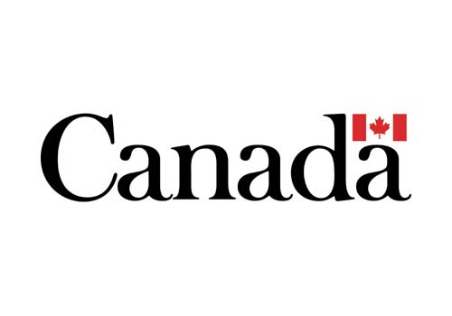

  

    
  

  

   
  

    
# Canada's Strategic Position on WTO Agricultural Trade Negotiation
## Project Overview
This project simulated a partial WTO agriculture negotiation, allowing participants to apply trade policy concepts in a practical setting. 

### Case Study 
- The case study focused on a U.S. proposal to cut agricultural subsidies through reductions in Aggregate Measure of Support (AMS) commitments.
- The proposal included a 20% cut to final bound AMS for WTO members with existing commitments, phased in over three years.
- De minimis support levels for developed countries from 5% to 1% and for developing countries from 10% to 2%, with least-developed countries exempt.
- Assumption that AMS exemptions for public food stockholding would end in 2027.  

The simulation required participants to assume the role of their country’s WTO representative and determine their stance within 15 minutes. They analyzed how the proposal would impact their domestic agricultural policies, market access, and political landscape while considering potential alliances and negotiation strategies. The urgency of the negotiation was heightened by the U.S. threat to withdraw from the WTO and impose unilateral tariffs if no agreement was reached. 

## Canada Trade Profile 
Trade Minister: Mary Ng
Website:https://www.pm.gc.ca/en/cabinet/honourable-mary-ng or https://maryng.libparl.ca/about/ 
#### Country data
Population: 40,097,761
- GDP per capita: $US 53,431. 2
- GNI per capita (country income category): $US 54,040
- Urban population/rural population: 32,824,829/7,272,932
- System of government: Federation, Constitutional monarchy, Parliamentary democracy

#### Agricultural sector
Table 1: Value of Agricultural Production
  | Year | Value (USD)          |
  |------|----------------------|
  | 2022 | $330,681,302,000    |
  | 2021 | $237,867,165,000    |
  | 2020 | $219,268,576,000    |
  | 2019 | $210,635,023,000    |
  | 2018 | $217,628,479,000    |

Table 2: Agriculture, Forestry, and Fishing, as Value Added (% of GDP)
| Year | Value Added (% of GDP)  |
|------|-------------------------|
| 2022 | N/A                     |
| 2021 | N/A                     |
| 2020 | 1.84%                   |
| 2019 | 1.70%                   |
| 2018 | 1.70%                   |
| 2017 | 1.89%                   |
| 2016 | 1.86%                   |

Table 3: Agriculture exports as % of all merchandise trade
| Year | Trade                  | % of All Merchandise Trade |
|------|------------------------------|----------------------------|
| 2021 | Agriculture Exports          | 17.2%                      |
| 2021 | Agriculture Imports          | 9.6%                       |

Table 4: Top 5 Agricultural Commodities Produced (2023)
| Year | Commodity                | Type       | Production (tonnes)  |
|------|--------------------------|------------|----------------------|
| 2023 | Wheat                    | Food       | 31,954,115           |
| 2023 | Rapeseed/Colza Seed      | Non-Food   | 18,328,233           |
| 2023 | Maize (Corn)             | Food       | 15,075,930           |
| 2023 | Raw Milk (Cattle)        | Food       | 9,886,559            |
| 2023 | Barley (Primarily Food)  | Food       | 8,896,244            |

Table 5: Top 5 Agricultural Exports by Value (2023)
| Year | Commodity                 | Top 5 Export Destinations         |
|------|---------------------------|------------------------------------|
| 2023 | Wheat                     | China, Indonesia, USA, Japan, Algeria  |
| 2023 | Rapeseed                  | China, Japan, Mexico, USA, UAE        |
| 2023 | Cake of rapeseed          | USA, China, Malaysia                |
| 2023 | Soya bean                 | China, Iran, Japan, Algeria, Indonesia  |
| 2023 | Crude Rapeseed/Canola oil | USA, China, Rep. of Korea, Mexico, Japan |

Table 6: Top 5 Agricultural Imports by Value (2023)
| Year | Commodity                  | Top 3 Import Partners         |
|------|----------------------------|-------------------------------|
| 2023 | Maize/Corn                 | USA, Mexico, Italy            |
| 2023 | Raw Cane or beet sugar     | Brazil, El Salvador, Guatemala|
| 2023 | Cake of soya beans         | USA, India, Togo              |
| 2023 | Food preparation n.e.c     | USA, China, Other Asia, nes   |
| 2023 | X                          | USA, India, Turkey            |

#### Market Access 

Table 7: Tariff Overview
| Item                                        | Agriculture (%) | Non-Agriculture (%) |
|---------------------------------------------|-----------------|---------------------|
| Simple Average Final Bound Tariff           | 15.6            | 5.1                 |
| Simple Average MFN Applied Tariffs          | 14.8            | 2.0                 |
| Difference Between Final Bound and MFN Applied Tariffs | 0.8            | 3.1                 |
| Number of Agricultural Tariff Lines Over 100% | 4.6             | 0                   |
| Tariff Quotas (in % of All Tariff Lines)    | 9.5             | N/A                 |
| List of Agricultural Imports Subject to Tariff-Rate Quotas | wheat, barley, meat and veal, poultry and egg products, dairy products | N/A |

Table 8: Average Applied MFN Tariff by Product
| Product                    | Average Applied MFN Tariff (%) |
|----------------------------|-------------------------------|
| Animal                     | 21.6                          |
| Dairy                      | 222.8                         |
| Cereals and preparations   | 11.8                          |
| Cotton                     | 0.0                           |

#### Domestic Support Review
Domestic support reduction commitment? Yes
Bound AMS under the Agreement on Agriculture: [$CAD 4,301,000,000/ $USD 3,000,000,000]
Most recent Domestic Support notification: [2022]

Table 9: Recent Domestic Support Expenditure
| Year | Current Total AMS           | Total Green Box Support    | Special and Differential Treatment Spending |
|------|-----------------------------|----------------------------|---------------------------------------------|
| 2022 | $CAD 1,225,500,000 / $USD 854,745,826 | $CAD 2,455,500,000 / $USD 1,712,424,722 | N/A                                         |

Table 10: Agricultural Commodities Receiving Product-Specific Support (Top 3)
| Commodity | Product-Specific Support (CAD) | Product-Specific Support (USD) |
|-----------|---------------------------------|--------------------------------|
| Milk      | $1,192,300,000                  | $831,099,102                   |
| Pork      | $173,300,000                    | $120,795,470                   |
| Beef      | $99,300,000                     | $69,211,986                    |

Table 11: Agricultural Commodities Receiving Market Price Support (Top 3)
| Commodity | Market Price Support (CAD) | Market Price Support (USD) |
|-----------|-----------------------------|----------------------------|
| Butter    | $721,000,000                | $502,539,984               |
| N/A       | N/A                         | N/A                        |
| N/A       | N/A                         | N/A                        |

### Summary of Analysis
- Market Access and Export Priorities: Canada is a major agricultural producer, with significant exports of commodities such as wheat, rapeseed (canola), maize, and soybeans. In 2023, the top export commodities also include barley and raw milk. The top export destinations for Canadian agricultural products include China, the USA, Japan, Mexico, and various countries in the Middle East and Asia. This indicates a strong focus on these markets, where Canada is likely to seek even greater access. For example, wheat and rapeseed are major exports, with China and Japan being key markets for these products. The data suggests that Canada would continue to push for reduced barriers and favourable trade terms in these regions to boost its exports further.
- Protection of Domestic Industries: The data shows that Canada has substantial domestic support measures in place, especially for milk, pork, and beef, indicating the sectors where Canada might seek to protect its producers from international competition. The high average applied MFN (Most Favored Nation) tariffs on dairy (222.8%) and relatively high tariffs on animal products (21.6%) suggest a defensive stance to shield these sectors from foreign market pressures. The presence of tariff quotas on imports of wheat, barley, meat, and dairy products further underlines the protective measures aimed at these sensitive sectors.
- Stakeholders and Sector Interests
  - Dairy Sector: This sector has the highest tariff protection and substantial product-specific support (notably for milk). Therefore, it is likely to push for maintaining high tariffs and subsidies to protect against cheaper foreign imports and sustain domestic production.
  - Livestock Sector (Pork and Beef): Given the significant domestic support and protective tariffs, stakeholders in these industries would likely advocate for continued or enhanced protective measures to safeguard against competition and fluctuating global prices.
  - Cereal Producers (Wheat, Barley): Although Canada seeks to expand market access for these products, domestic producers may still require some forms of support or protection mechanisms to ensure stability in the face of international market volatility.

### Strategic Analysis of the Partial Simulation of WTO Negotiation on Agriculture
- Following the proposed 20% cut to the Current Bound Aggregate Measure of Support (AMS), Canada’s AMS would reduce from CAD 4.3 billion to CAD 3.44 billion.  
- This reduction would also entail recalculating the AMS in USD, dropping from USD 3 billion to USD 2.4 billion.  
- Such cuts necessitate a careful reassessment of the support mechanisms in place, particularly the de minimis provisions, which are set to reduce significantly from 5% to 1% for developed countries.  
- This reduction impacts commodities like poultry, potatoes, and pork, which, while not among the top five exports, play a crucial role domestically.  

- The reallocation of minor subsidies due to the de minimis reduction means that support traditionally afforded to these smaller-scale sectors would need to be reclassified under the AMS.  
- Previously, commodities such as wheat, rapeseed, and soybeans which are Canada’s primary agricultural exports were directly supported under the AMS, given their significant market value.  
- With the de minimis reduction, the Current Total AMS of CAD 1,225.5 million would effectively increase to CAD 1,493.8 million after reallocating CAD 268.3 million from the affected products.  
- This reallocation results in a new ratio of Current AMS to the Final Bound AMS of 35.61%, up from 28.49%, reflecting tighter margins within the adjusted cap of CAD 3.44 billion.  

- This tightening could reduce the government's support for farmers, affecting production levels and domestic market prices.  
- Reducing government subsidies, particularly for smaller farms and rural communities, could have significant social and political repercussions.  
- These groups are vital to the electoral base of current officeholders, and their discontent could translate into political resistance against the new subsidy structures.  

- However, Canada maintains a strong position in the negotiations.  
- The primary exports, including wheat, rapeseed, and soybeans, are not heavily reliant on de minimis supports and thus remain outside the direct influence of these proposed changes.  
- Given the ample margin within the new AMS (final bound minus the new current total AMS), Canada might strategically support the U.S. proposal in the negotiations.  
- However, this support should be conditional on addressing the potential trade imbalance that would result from the 25% tariff on Canada's exports to the USA (as this would affect our major valued exports).  
- The US should consider the total removal or significant reduction of the 25% unilateral export tariffs introduced by the U.S. on Canadian exports.

### Recent Developments and Implications
Canada's legislative arm of government recently amended Bloc Québécois supply management bill. Read: https://www.cbc.ca/news/politics/supply-management-bill-senate-1.7376654 

#### Possible impact of Bill C-282 on Trade Policy

- Bill C-282, proposed by the Bloc Québécois, seeks to protect Canada’s supply-managed sectors (dairy, poultry, and eggs) by prohibiting future trade concessions that could open these markets to foreign competition.
- This bill reflects strong defensive interests, particularly in Quebec, where supply management is a critical economic and political issue.
- The bill’s passage or even its consideration signals that Canada’s trade negotiators may face increased pressure to prioritize the protection of supply-managed sectors over offensive interests, such as expanding market access for other agricultural exports like wheat, canola, and soybeans.

#### Senate Amendments and Trade Risks
- The Senate amended Bill C-282 to mitigate its impact on existing and ongoing trade agreements, reflecting concerns about provoking trade disputes, particularly with the U.S.
- The U.S. has historically been critical of Canada’s supply management system, and under a potential second Trump administration, the risk of retaliatory tariffs or other measures increases.
- A trade war with the U.S. could harm Canada’s broader agricultural exports, making it essential to balance domestic political pressures with international trade obligations.

#### WTO AMS Cuts and Domestic Implications
- A proposed 20% cut to Canada’s final bound Aggregate Measure of Support (AMS) would reduce it from CAD 4.3 billion to CAD 3.44 billion. While Canada can likely withstand this reduction, the accompanying reduction in de minimis support from 5% to 1% could disproportionately affect smaller-scale sectors like poultry and pork, which rely on these subsidies.
- This could lead to political backlash from rural communities and supply-managed sectors, complicating the government’s ability to implement the proposed cuts.
- The reallocation of subsidies due to the de minimis reduction may also strain support for other agricultural commodities, potentially impacting production levels and domestic market prices.

### Strategic Recommendations for Trade Negotiations
- Conditional Support for AMS Cuts: Canada should consider supporting the U.S. proposal for AMS cuts, but only if the U.S. agrees to remove or significantly reduce the 25% unilateral tariffs on Canadian exports, particularly for key commodities like wheat, canola, and soybeans.
- Balancing Defensive and Offensive Interests: Canada must navigate the competing demands of protecting supply-managed sectors and advancing offensive interests in global markets. This requires a nuanced approach that balances domestic political pressures with the need to maintain strong international trade relationships.
- Mitigating Political Risks: The government should engage with stakeholders in supply-managed sectors and rural communities to address concerns about subsidy reductions and ensure that any changes to domestic support mechanisms are implemented gradually and with adequate compensation.

### Long-Term Trade Strategy
- Canada should prioritize diversifying its export markets to reduce reliance on the U.S. and mitigate the risks of trade disputes.
- Strengthening trade relationships with key markets like China, Japan, and the EU can provide alternative opportunities for agricultural exports.
- Canada should also advocate for a more transparent and standardized framework for WTO negotiations, ensuring that domestic support policies align with international trade rules while protecting critical sectors.

## Data Collection Instructions for the Strategic Trade Profile

#### Population Data
- Total Population (current, in millions): https://databank.worldbank.org/source/world-development-indicators 

#### Economic Indicators
- GDP per Capita: https://databank.worldbank.org/source/world-development-indicators  (current and historical for the last 10 years, in current US dollars)
- Country by Income Status: https://blogs.worldbank.org/opendata/new-world-bank-country-classifications-income-level-2020-2021

#### Agricultural Data
- Gross Production Value of Agriculture: https://www.fao.org/faostat/en/#data  (all items aggregated for the last available 5 years, in current US dollars)
- Agriculture, Forestry, and Fishing Value Added (% of GDP): https://databank.worldbank.org/source/world-development-indicators 
 
#### Agricultural Commodities Production and Trade
- Top 5 Agricultural Commodities Produced (by tonnes/value, last available year): http://www.fao.org/faostat/en/#rankings/commodities_by_country
- Top 5 Agricultural Commodities Exported (by tonnes/value, last available year): see  http://www.fao.org/faostat/en/#rankings/commodities_by_country
   #####  Identify Top 5 Export Markets for each commodity:
  - Look up HS code for each commodity: https://www.tariffnumber.com  (type commodity in search box)
  - Record the HS code (both 4 and 8 digit numbers)
  - Retrieve trade data: https://comtrade.un.org/Data/
    - Section 1: Products type “goods” and frequency “annual”
    - Section 2: Classification as HS code “as reported”
    - Section 3: Period “2023 (or 2024 if available)”, Reporter = country; Partners = “All”, Trade flows = “export”'
    - Section 4: Enter “4 digit HS code” from step 2
    - Sort trade value in descending order to see top 5 export markets (exclude “world” total, list countries only)

- Top 5 Agricultural Commodities Imported (by tonnes/value, 2018):  http://www.fao.org/faostat/en/#rankings/commodities_by_country
  - Identify Top 3 Import Partners using the same method as for exports

#### Trade Statistics
- Agriculture Exports as % of All Merchandise Trade: Retrieve from the country’s WTO member “trade profile”.  (go to member’s page; go to https://www.wto.org/english/thewto_e/whatis_e/tif_e/org6_e.htm  then select your country, go the trade statistics section, click on “trade profile” and download as PDF)
- Agriculture Imports as % of All Merchandise Trade: (follow same step above)

#### WTO-Specific Data

##### Tariff Profile
- Visit the country’s WTO members page (https://www.wto.org/english/thewto_e/whatis_e/tif_e/org6_e.htm) and navigate to the Goods, Services Schedules, and Tariff Data section.
- Obtain a summary of tariff data by downloading the PDF from the “Source” section and review the “Technical Note” for detailed explanations.
- Make note of the following:
  - Simple average final bound tariff for agriculture (Ag)
  - Simple average most-favoured nation (MFN) applied tariff for agriculture (Ag)
  - Difference between final bound and MFN applied tariffs (a proxy for tariff flexibility)
  - Percentage of agricultural tariff lines over 100%
  - Agricultural products subject to tariff-rate quotas (TRQs)
     - For confirmation, locate and open the country’s most recent Trade Policy Review:
        - Go to WTO Trade Policy Reviews by country (https://www.wto.org/english/tratop_e/tpr_e/tp_rep_e.htm#bycountry )
        - Select the country.
        - Under documents, select “Secretariat report — a detailed report written independently by the WTO Secretariat.”
        - Use the text search function in your PDF reader for “tariff rate quota” and/or “TRQ.”
        - Review the purpose of a Trade Policy Review.
       
##### Average Applied MFN Tariffs
- Categories: Animal, Dairy, Cereals and Preparations, and Cotton
- Retrieve this data from the tariff profile document downloaded.

##### Domestic Support
- WTO Commitment to Reduce Trade-Distorting Domestic Support:
  - Check if the country has a commitment to reduce trade-distorting domestic support (Amber Box/AMS) at WTO Agricultural Boxes (https://www.wto.org/english/tratop_e/agric_e/agboxes_e.htm)

- Domestic Support Spending
  - Visit the WTO Notification Portal ( https://notifications.wto.org/en )
    - Select “Notifications by Agreement.”
    - Select “Agreement on Agriculture.”
    - Select the tab “AGR Art 18.2-DS:1.”
    - Scroll the list for the country and download the most recent notification (green checkmark).
    - Expect to see these tables:
       - Table DS:1 - Current Total Aggregate Measurement of Support
       - Supporting Table DS:1 - Measures exempt/Green Box
       - Table DS:2 - Special and Differential Treatment/Development Programmes (for developing countries)
       - Supporting Table DS:4 - Calculation of AMS (by commodity)
       - Supporting Table DS:5 - Product-Specific Aggregate Measurements of Support: Market Price Support
       - Supporting Table DS:6 - Product-Specific Aggregate Measurements of Support: Non-Exempt Direct Payments

##### Product-Specific Support
- If AMS is reported, identify the top 3 agricultural commodities that received product-specific support and their amounts (usually listed in Supporting Table DS:4).

##### Market Price Support
- If market price support is offered, list the top 3 agricultural commodities (typically found in Supporting Table DS:5).

##### Other WTO Relevant Information
- Group and/or Coalition Bloc Membership
  - Check if the country is a member of any groups or coalitions in WTO agriculture negotiations on its member profile page: WTO Member Profiles (https://www.wto.org/english/thewto_e/whatis_e/tif_e/org6_e.htm )
  
##### Agricultural Trade Disputes
- Verify current or past agricultural trade disputes with other WTO members
  - Go back to the country’s WTO member page.
  - Check “Disputes involving [COUNTRY]” under “As Complainant” and “As Respondent.”
  - Determine if any cases related to agri-food products are still relevant (exclude cases older than 10 years).

## Other References
Margulis, M. (2025). Global Food and Resource Economics (FRE 531). Faculty of Land and Food Systems, University of British Columbia.

  
